# What's in an Opportunity Zone?

  

Paxton Hyde

Galvanize Data Science Immersive Capstone 2, March 2020

## Content
- [Background](#background)
- [Data](#data)
- [Topic modeling with NMF](#NMF)
- [Hard clustering](#clustering)
- [Future work](#nextsteps)
- [References](#references)

## Background

The Tax Cuts and Jobs Act of 2017 introduced an Opportunity Zone (OZ) program that allows capital gains tax deferrals and other benefits for investments in designated census tracts. The purpose of the program is to encourage investment in struggling communities. The idea is that the tax benefits will offset extra costs and risks associated with developing in neglected areas with smaller markets. News reporting critiques the program over its liberal designation process, which risks make the tax benefits a giveaway to wealthy investors who would have developed in any case.[1](#footnote1) The Economist notes, for example, that a tract in downtown Portland, Maine that hosts 200 thousand tourists annually was designated as an OZ.[2](#footnote2)

Furthermore, research does not suggest that place-based tax incentive programs are particularly effective. It seems that any new jobs created simply replace old jobs that already existed or are taken by high-skilled workers who move in from elsewhere.[3](#footnote3)

President Trump has recently claimed victory for the program even though it is under investigation by the Treasury Department.[4,](#footnote4)[5](#footnote5) Congress also has not introduced regulation requiring data collection and reports on the effects of the program.[6](#footnote6)

#### Opportunity Zone Designation Process

  <object data="images/oz_flow.pdf" type="application/pdf" width="800px" height="450px">
      <embed src="images/oz_flow.pdf"></embed>
  </object>

State Governors nominate Census Tracts in their state as OZs, and the Secretary of the Treasury approves these selections. A tract is eligible if:
 
- it meets the requirements of a *low-income community* (LIC), meaning that it has a 20% poverty rate and has a median family income is no more than 80% of the revelant surrounding area;[7](#footnote7) or  
 
- it is adjacent to an LIC and has a median household income of no more than 125% of that tract. 

Governors may nominate up to one-quarter of the LIC tracts in their state, or up to 25 if their state has less than 100 LICs. In addition, they may nominate a number of LIC-adjacent tracts up to five percent of the total tracts in the state. Designations may be based on data from 2011-2015 or more recent American Community Survey (ACS) 5-year estimates.[8](#footnote8)

#### This Study's Method

Based on the reporting of the misdesignation of OZs providing tax benefits to certain tracts which are already gentrifying or seem undeserving for other reasons, the goals of this project are to:

1. use topic modeling / soft clustering to identify archetypes or categories of the OZ tracts that seem *suspect* and undeserving of tax relief, and

2. use hard clustering to find tracts that represent the categories that we think should not be receiving tax relief. We will be able to say that these tracts were misdesignated.

## Data

#### Feature Selection

I gathered data for OZ tracts from the 2012 and 2017 ACS 5-year estimates using the Census Data API and the [`census`](https://pypi.org/project/census/) module available on PyPi. 

Gentrifying areas generally have:
- an influx of people
- significant racial mixture
- a young population 
- a high percentage of renters and multi-unit housing
- recent development, and 
- increasing incomes and home values.

Based on this idea, the relative values of following features should increase our suspicion about an OZ designation.

| +   | - |
|-------|--------|
| % of residents who have never been married |      median age of residents|
| % white population  |     % black population |
| median household income and home value  |    poverty rate |
| % of housing with multiple units | % of housing which are mobile homes |
| % residents moving in from another county in the past year | housing vacancy rate |
| median year of building construction | |
| LIC-adjacent community | *(low income community)* |

#### EDA

863 of 8,761 (~10%) designated Opportunity Zones are in Puerto Rico, which makes sense given that the island's median income is about a third of the at-large United States median. Given this, I knew to be wary of Puerto Rico forming its own topics or clusters.

  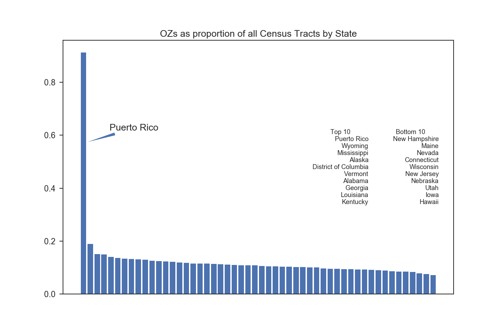

We can get a sense of the "normal" values for our shotgun features by looking at their distributions. OZs are generally younger (~35), less white (~55%), and have a higher vacancy rate than the rest of the country. "Out of county flux" is the percent of residents who moved from another county in the past year, which is ~8% for OZs.

Note that the designation of OZs is not suspect because the tracts differ from the general population. Rather, they would be suspect because they have a particular combination of features. For example, a tract which was young because it is in the middle of the city or has many young families should be differentiated from a tract which is young because it is mostly students.

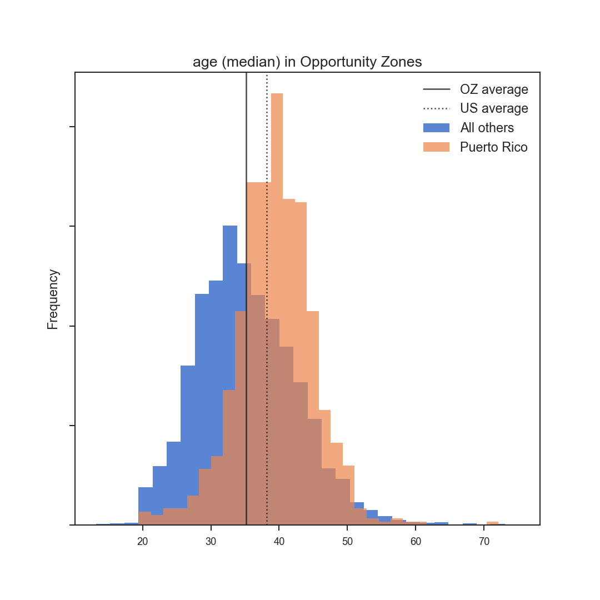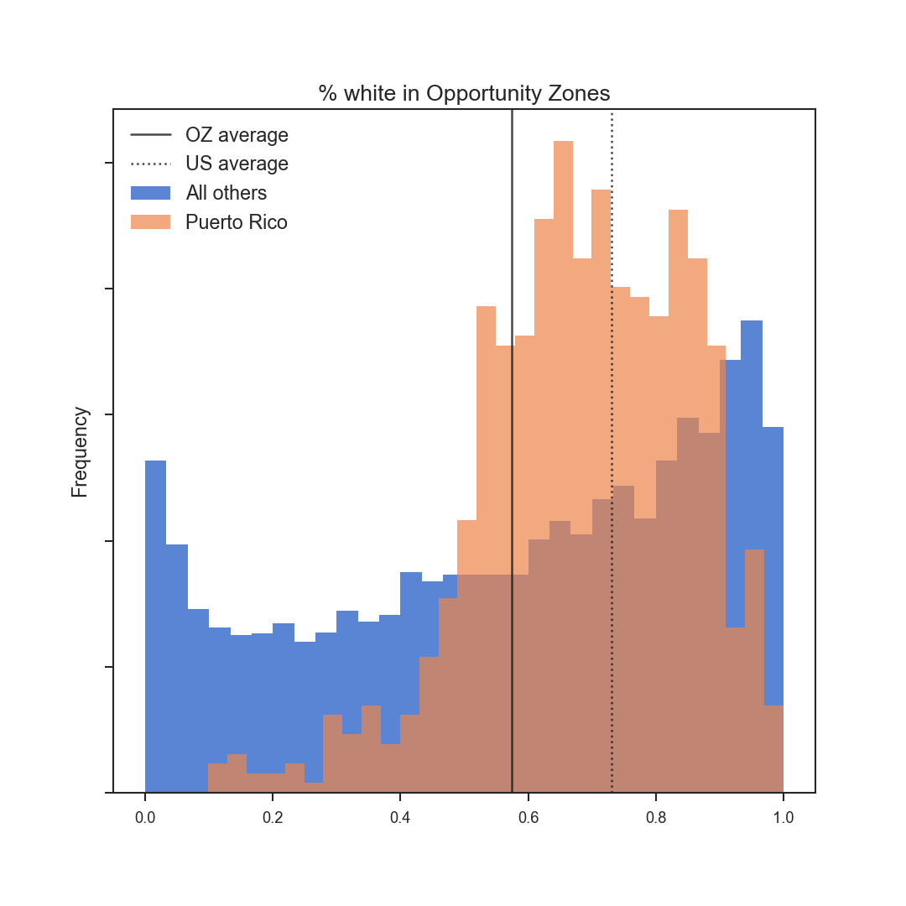
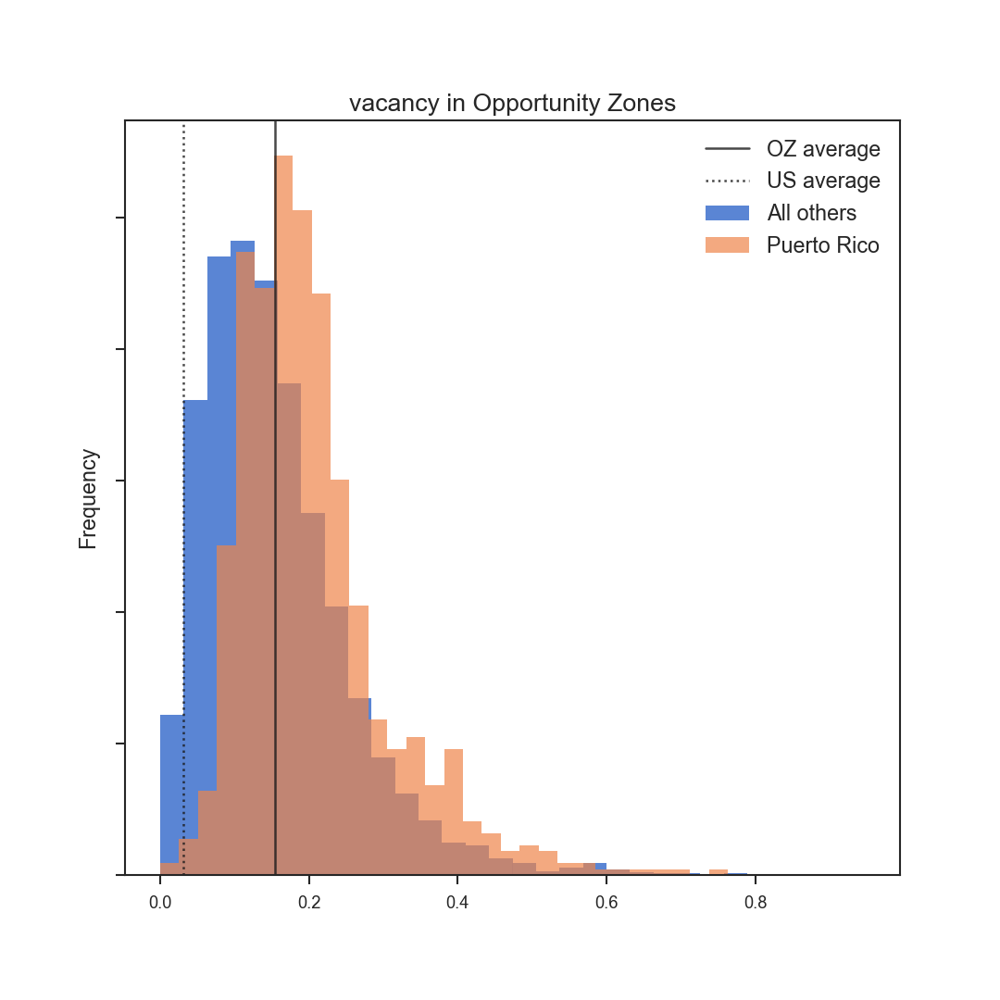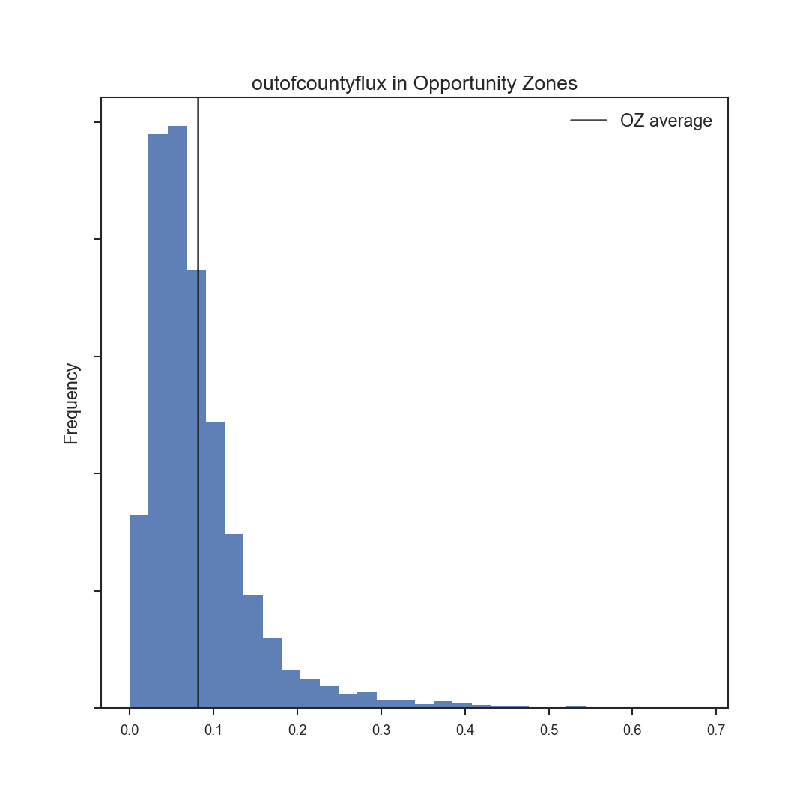

## NMF

The first goal of the project is to describe the archetypes of designated Opportunity Zones. Because I am essentially looking for outliers in the data, I knew I would need to sift through some other archetypes before I found a type with a suspect combination of features. The idea behind using soft clustering is that it would make sense that a neighborhood could be categorized in multiple ways. (LoHi, for example, is often a mix of very new apartments and older single family houses.)

These plots of the non-negative matrix factorization (NMF) components for each component (group, in other words) show how much each feature effects the likelihood of a particular observation (an OZ tract, in this case) being in a particular cluster.

  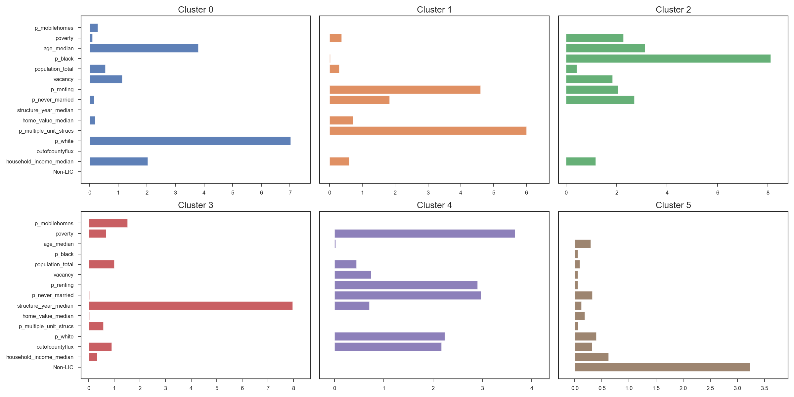

Cluster 0 looks more like the U.S. average than a low-income community, given that it has higher weights of % white, household income, and age. Lightly suspicious.

Cluster 1 looks like a developed urban area or university campus.

Cluster 2 looks like what some might call an "inner-city" (read: poor black neighborhood) archetype.

Cluster 3 is almost too sparse to interpret, but could be a tract is recently developed.

Cluster 4 looks almost like a university campus.

Cluster 5 loads heavily on not being a *low-income community*, and has some other features that we would expect to accompany that type.

  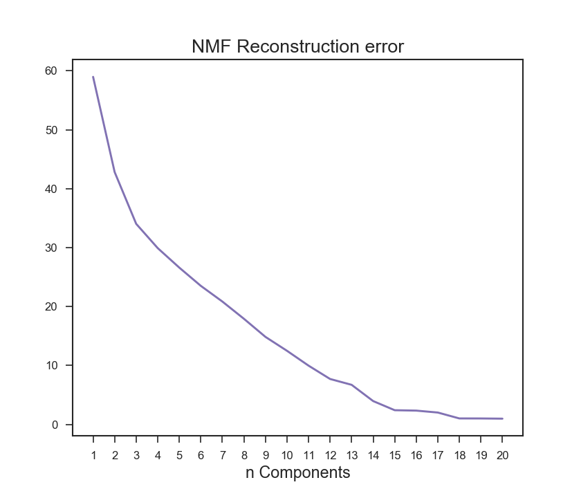

There was no clear elbow in the reconstruction error, so I wanted to see what the "optimum" number of clusters looks like. At this level, the clusters have lost interpretability because they are grouped on just one or two features.

  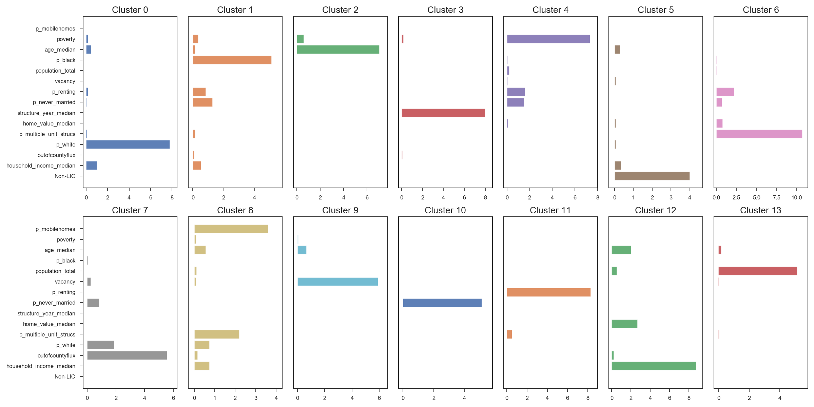

Based on this NMF, it looks like I will have to re-featurize for my next capstone:

* The year a structure is built weighed on most of the categories in my six-component sample. This makes sense given that the difference between 1940 and 1970 on a unit scale is both small, and the absolute value is always large when scaled by the largest value for the feature. 

* Whether a tract is a *low-income community* or adjacent to one is the only categorical feature, and so weighed very heavily on one cluster at the expense of other features.

* It could simplify my model to eliminate features that we would suspect to be indirectly related, such as median age and % never married, vacancy and out-of-county influx, multiple-unit structures and % mobile homes, and maybe home value and household income.

* Population is a not very useful feature given that tracts vary in area. Maybe state-level population density could substitute until I find densities on a tract level.

* Add noncollinear demographic information, such as educational attainment.

## Clustering

I found a KMeans clusterer to produce the most interpretable archetypes, as I was seeing with NMF.

  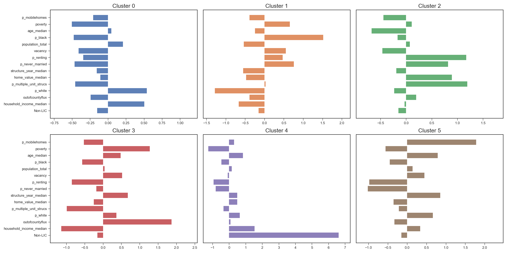
  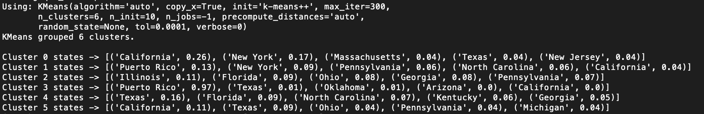

Cluster 0 is more towards generic America, although may be skewed by the fact that California, New York, and Massachusetts have higher costs of living. Cluster 4 is heavily weighted on not being a LIC, although given that the weightings of household income and whiteness are large on an absolute scale, it fits in with cluster 0.

Cluster 1 is "inner-city." 

Cluster 2 is a young gentrifying neighborhood or university campus (suspect!). 

Cluster 3 is Puerto Rico.

Cluster 5 is older, whiter, poorer suburbs.

#### Silhouette

A silhouette coefficient is a measure of the ratio of the intra- to inter-cluster distances on the range -1 to 1. The silhouette plot displays this coefficient for each observation.

  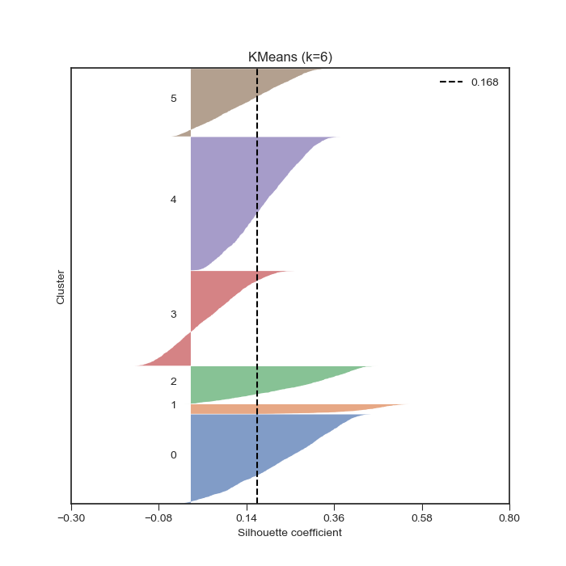

Although the accuracy of this plot is not a great look, it does tell us two interesting things:

1. KMeans clustered Puerto Rico because it has some absolute values that are significantly different than the rest of the U.S. (household income, for example), but *not* because Puerto Rican tracts are similar. This gives more reason to exclude Puerto Rico completely unless we can account for geographical differences in cost of living.

2. Cluster 1 and 2, which we think represent more urban areas, are small because their archetype is not well-defined by the features. Other clusters actually accomodate those tracts which do not fit the urban archetype as well.

#### DBCAN
The DBSCAN algorithm searches for areas of density based on a distance parameter and a minimum number of samples forming a core area. 

I found that this clusterer tended to find similar groups multiple times. It is essentially looking for pockets of homogeneity. Clusters 2, 3, 5, and 7 are almost identical, with the rest being very similar except with more mobile homes and varying household income. The homogeneity is also represented in the majority states for each cluster, which tend to be places without dynamic cities that we would expect to have tracts of interest.

A possible use of DBSCAN in a future iteration would be to look closer at the outliers it produces.

  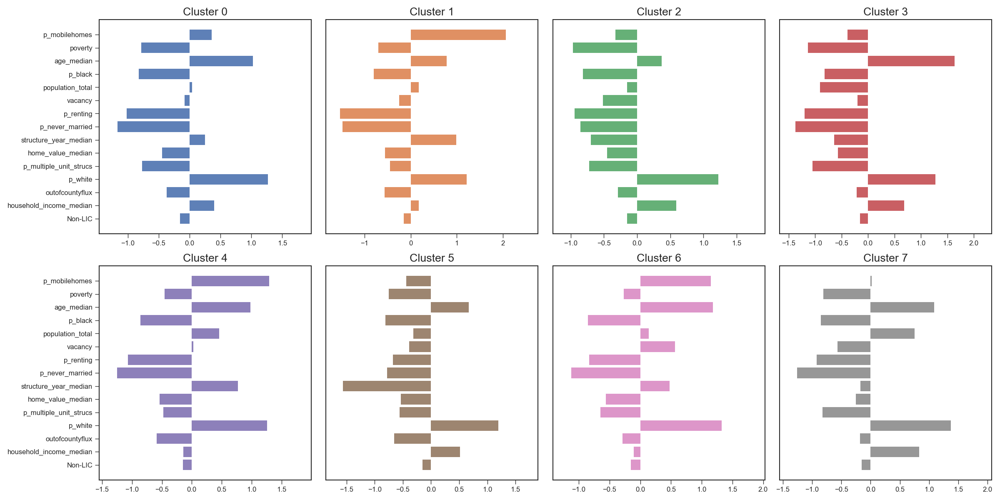
  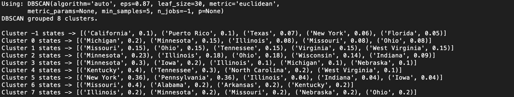

## Next Steps

1. Refeaturize based on my outline in the NMF section and reading how other researchers have evaluated Opportunity Zones

2. Test a cosine distance metric in clustering to account for different costs of living across states

3. Use a stacked clustering model to find outlier clusters (by clustering on clusters), or more fine-grained clusters (by clustering within clusters)

4. Use the word "cluster" another 100,000 times

[Back to top](#content)

## References
<a name="footnote1">1</a> Critical reporting on Opportunity Zones:

- [How a Trump Tax Break to Help Poor Communities Became a Windfall for the Rich](https://www.nytimes.com/2019/08/31/business/tax-opportunity-zones.html): *The New York Times*  (08/31/2019)

- [A Trump Tax Break To Help The Poor Went To a Rich GOP Donor’s Superyacht Marina](https://www.propublica.org/article/superyacht-marina-west-palm-beach-opportunity-zone-trump-tax-break-to-help-the-poor-went-to-a-rich-gop-donor): *Pro Publica* (11/14/2019)

- [The Biggest Tax Cut You've Never Heard Of](https://www.economist.com/leaders/2018/11/17/the-biggest-tax-cut-youve-never-heard-of): *The Economist* (11/17/2018)

<a name="footnote2">2</a> [Bringing Investment to Poor Places](https://www.economist.com/united-states/2018/11/17/bringing-investment-to-poor-places): *The Economist* (11/17/2018)

<a name="footnote3">3</a> [Opportunity Zones:  What We Know and What We Don’t](https://files.taxfoundation.org/20190107155914/Opportunity-Zones-What-We-Know-and-What-We-Don%E2%80%99t-FF-630.pdf): Eastman, Scott and Nicole Kaeding, *The Tax Foundation* (01/07/2019)

<a name="footnote4">4</a> [Donald Trump 2020 State of the Union Address, mention of Opportunity Zones](https://www.youtube.com/watch?v=zNECVmfJtxc&t=15m38s): *Youtube* (02/06/2020)

<a name="footnote5">5</a> [Trump Tax Break That Benefited the Rich Is Being Investigated](https://www.nytimes.com/2020/01/15/business/trump-opportunity-zone-investigation.html?action=click&module=Latest&pgtype=Homepage): *The New York Times*  (01/15/2020)

<a name="footnote6">6</a> Bills in-progress to regulate Opportunity Zones:

- [S.1344 - A bill to require the Secretary of the Treasury to collect data and issue a report on the opportunity zone tax incentives](https://www.govtrack.us/congress/bills/116/s1344), *govtrack.us*

- [H.R.5042 - Opportunity Zone Reform Act](https://www.govtrack.us/congress/bills/116/hr5042), *govtrack.us*

<a name="footnote7">7</a> [Definition of "Low-Income Community" – (26 USC § 45D(e)(1))](https://www.law.cornell.edu/uscode/text/26/45D): *law.cornell.edu*

<a name="footnote8">8</a> [Internal Revenue Code (26 USC §§ 1400Z)](https://www.law.cornell.edu/uscode/text/26/subtitle-A/chapter-1/subchapter-Z): *law.cornell.edu*, and

- [QOZ designation procedures (6 CFR 601.601: Rules and regulations)](https://www.irs.gov/pub/irs-drop/rp-18-16.pdf): *Internal Revenue Code*

[Opportunity Zones Resources](https://www.cdfifund.gov/Pages/Opportunity-Zones.aspx): *CDFI Fund*

[Brookings Distress Index](https://www.brookings.edu/research/the-early-results-of-states-opportunity-zones-are-promising-but-theres-still-room-for-improvement/#footnote-1): *Brookings Institute*

* by state:
* poverty adjusted for student population
* child poverty rate
* educational attainment
* income growth
* change in poverty rate

