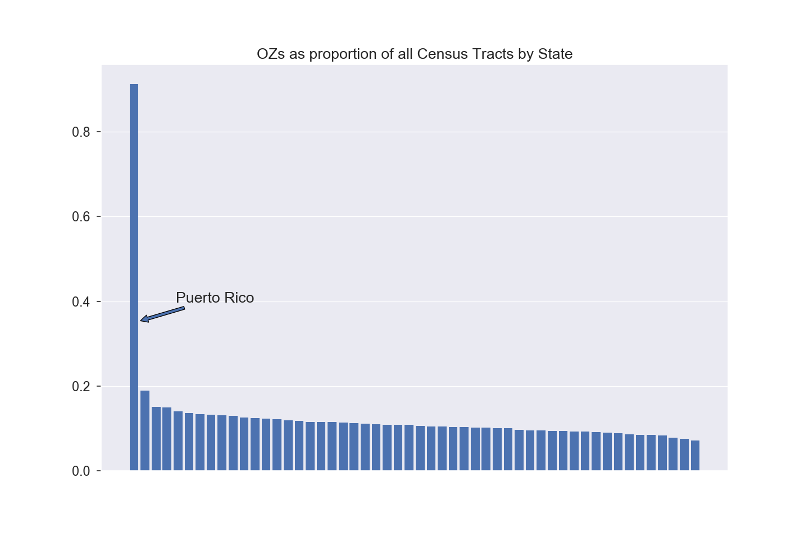

# opportunity-zones

  

Paxton Hyde

Galvanize Data Science Immersive Capstone 2, February 2020

## Content
- [Background](#background)
- [Data](#data)
- [Topic modeling with NMF](#NMF)
- [Hard clustering](#Clustering)
- [Takeaways](#takeaways)
- [References](#references)

## Background

The Tax Cuts and Jobs Act of 2017 introduced an Opportunity Zone (OZ) program that allows capital gains tax deferrals and other benefits for investments in designated census tracts. The purpose of the program is to encourage investment in struggling communities. The idea is that the tax benefits will offset extra costs and risks associated with developing in neglected areas with smaller markets. News reporting critiques the program over its liberal designation process, which risks make the tax benefits a giveaway to wealthy investors who would have developed in any case.[1](#footnote1) For example, the Economist notes that a tract in downtown Portland, ME that hosts 200 tourists annually was designated as an Opportunity Zone.[2](#footnote2)

Furthermore, research does not suggest that place-based tax incentive programs are particularly effective. It seems that any new jobs created simply replace old jobs that already existed or are taken by high-skilled workers who move in from elsewhere.[3](#footnote3)

President Trump has recently claimed victory for the program even though it is under investigation by the Treasury Department.[4,](#footnote4)[5](#footnote5) Congress also has not introduced regulation requiring data collection and reports on the effects of the program.[6](#footnote6)

#### Opportunity Zone Designation Process
todo: flow chart

State Governors nominate Census Tracts in their state as OZs, and the Secretary of the Treasury approves these selections. A tract is eligible if:
 
- it meets the requirements of a *low-income community* (LIC), meaning that it has a 20% poverty rate and has a median family income is no more than 80% of the revelant surrounding area;[7](#footnote7) or  
 
- it is adjacent to an LIC and has a median household income of no more than 125% of that tract. 

Governors may nominate up to one-quarter of the LIC tracts in their state, or up to 25 if their state has less than 100 LICs. In addition, they may nominate a number of LIC-adjacent tracts up to five percent of the total tracts in the state. Designations may be based on data from the 2011-2015 or more recent American Community Survey (ACS) 5-year estimate.[8](#footnote8)

#### Method

Based on the reporting of the misdesignation of OZs providing tax benefits to certain tracts which are already gentrifying or seem undeserving for other reasons, the goals of this project are to:

1. use topic modeling / soft clustering to identify archetypes or categories of the OZ tracts that seem *suspect* and undeserving of tax relief, and

2. use hard clustering to find tracts that represent the categories that we think should not be receiving tax relief. We will be able to say that these tracts were misdesignated.

## Data

#### Feature Selection

I gathered data for OZ tracts from the 2011-2015 ACS 5-year estimates using the Census Data API and the `census` module from PyPi. I picked features using a "shotgun" method, keeping in mind that I need them to differentiate *suspect* from legitimate OZs. 

Gentrifying areas generally have:
- an influx of people
- significant racial mixture
- a young population 
- a high percentage of renters and multi-unit housing
- recent development, and 
- increasing home values.

| +   | - |
|-------|--------|
| % residents moving in from another county |      median age of residents|
| % white population  |     % black population |
| median household income and home value  |      poverty rate |
|  |  |

Based on this idea, a higher relative value of following features should increase our suspicion about an OZ designation:

- % residents moving in from another county
- % white population
- median year of building construction
- % of housing with multiple units
- median household income and home value 
- % of residents who have never been married, and
- Non-LIC designation,

while the following would be negatively related to our suspicion:

- median age of residents
- % black population
- poverty rate
- housing vacancy rate, and
- % of housing which are mobile homes.

#### EDA

863 of 8,761 (~10%) designated Opportunity Zones are in Puerto Rico, which makes sense given that the island's median income is about a third of the at-large United States median. Given this, I knew to be wary of Puerto Rico forming its own topics or clusters.

  
  
  
  

## NMF
*p*-values from an independent *t*-test with unequal variances for gender preferences between clusters show all significant differences for a significance level of 0.10.

|       |   West |   East |   South |
|-------|--------|--------|---------|
| West  |      - |      0 |       0 |
| East  |      0 |      - |       0 |
| South |      0 |      0 |       - |

(Note that these values are unrounded, maybe `scipy.stats.ttest_ind()` rounds very very small numbers to 0.)

#### Without bootstrapping
Note that this direct (non-bootstrapped) test of country-level means does not control for the relative number of responses from each country.

  
  

The *p*-values from an independent *t*-test with unequal variances for gender preferences between clusters still show some significant differences for a significance level of 0.10. The Eastern cluster seems significantly different from the other clusters, which is not exactly what we expect based on the professional results.[1](#footnote1)

|       |      West |      East |     South |
|-------|-----------|-----------|-----------|
| West  | -         | 0.0838754 | 0.281225  |
| East  | 0.0838754 | -        | 0.0147172 |
| South | 0.281225  | 0.0147172 | -         |

## Future

1. WCV /silouhette

2. Use cosine distance metric to account for proportionality in data

3. Refeaturize

4. Cluster on clusters to figure out which rows load heavily on the "screwy" (– Frank) topics

[Back to top](#content)

## References
<a name="footnote1">1</a> Critical reporting on Opportunity Zones:

- [How a Trump Tax Break to Help Poor Communities Became a Windfall for the Rich](https://www.nytimes.com/2019/08/31/business/tax-opportunity-zones.html): *The New York Times*  (08/31/2019)

- [A Trump Tax Break To Help The Poor Went To a Rich GOP Donor’s Superyacht Marina](https://www.propublica.org/article/superyacht-marina-west-palm-beach-opportunity-zone-trump-tax-break-to-help-the-poor-went-to-a-rich-gop-donor): *Pro Publica* (11/14/2019)

- [The Biggest Tax Cut You've Never Heard Of](https://www.economist.com/leaders/2018/11/17/the-biggest-tax-cut-youve-never-heard-of): *The Economist* (11/17/2018)

<a name="footnote2">2</a> [Bringing Investment to Poor Places](https://www.economist.com/united-states/2018/11/17/bringing-investment-to-poor-places): *The Economist* (11/17/2018)

<a name="footnote3">3</a> [Opportunity Zones:  What We Know and What We Don’t](https://files.taxfoundation.org/20190107155914/Opportunity-Zones-What-We-Know-and-What-We-Don%E2%80%99t-FF-630.pdf): Eastman, Scott and Nicole Kaeding, *The Tax Foundation* (01/07/2019)

<a name="footnote4">4</a> [Donald Trump 2020 State of the Union Address, mention of Opportunity Zones](https://www.youtube.com/watch?v=zNECVmfJtxc&t=15m38s): *Youtube* (02/06/2020)

<a name="footnote5">5</a> [Trump Tax Break That Benefited the Rich Is Being Investigated](https://www.nytimes.com/2020/01/15/business/trump-opportunity-zone-investigation.html?action=click&module=Latest&pgtype=Homepage): *The New York Times*  (01/15/2020)

<a name="footnote6">6</a> Bills in-progress to regulate Opportunity Zones:

- [S.1344 - A bill to require the Secretary of the Treasury to collect data and issue a report on the opportunity zone tax incentives](https://www.govtrack.us/congress/bills/116/s1344), *govtrack.us*

- [H.R.5042 - Opportunity Zone Reform Act](https://www.govtrack.us/congress/bills/116/hr5042), *govtrack.us*

<a name="footnote7">7</a> [Definition of "Low-Income Community" – (26 USC § 45D(e)(1))](https://www.law.cornell.edu/uscode/text/26/45D): *law.cornell.edu*

<a name="footnote8">8</a> [Internal Revenue Code (26 USC §§ 1400Z)](https://www.law.cornell.edu/uscode/text/26/subtitle-A/chapter-1/subchapter-Z): *law.cornell.edu*, and

- [QOZ designation procedures (6 CFR 601.601: Rules and regulations)](https://www.irs.gov/pub/irs-drop/rp-18-16.pdf): *Internal Revenue Code*

[Opportunity Zones Resources](https://www.cdfifund.gov/Pages/Opportunity-Zones.aspx): *CDFI Fund*

