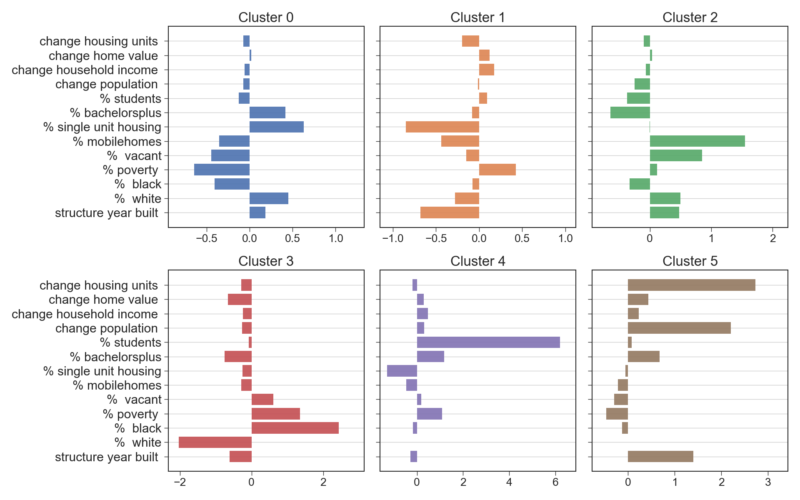
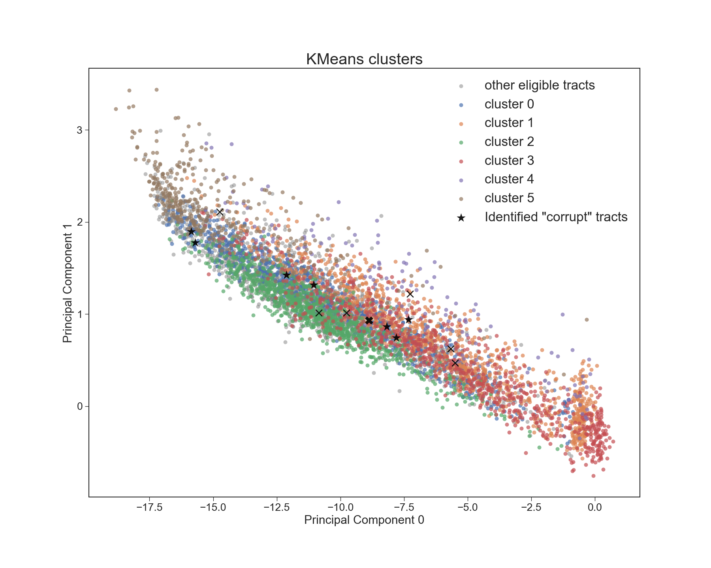

# Opportunity Zones: 

  

Paxton Hyde, March 2020

## Content
- [Background](#background)
- [Objectives](#objectives)
- [Data](#data)
- [Clustering](#clustering)
- [Denver map](#mappingtheclusters)
- [Conclusions](#conclusions)
- [References](#references)

## Background

The U.S. Tax Cuts and Jobs Act of 2017 introduced the Opportunity Zone (OZ) program to encourage investment in struggling communities. The program allows capital gains tax write-downs for investments in business or real estate in designated Census tracts. (A Census tract is a geographic subdivision of the country used for statistical purposes averaging about 4000 residents.) These tax benefits are provided to offset additional costs and risks associated with developing in neglected or weak markets. 

News reporting on OZs tends to be skeptical of the program, because it appears to be a tax giveaway to wealthy investors who would have developed anyways.[1](#footnote1) For example, the *Economist* weekly notes that the Old Port neighborhood in downtown Portland, ME was designated as an OZ despite its success as a tourist destination.[2](#footnote2) This sort of evidence suggests that the designation criteria are too lax.

Furthermore, research on similar place-based tax incentives shows that they have little if any effect on the economic well-being of an area's residence. The new jobs created usually either replace jobs that already existed or are taken by high-skilled workers who move in and gentrify the area.[3](#footnote3)

President Trump has recently proclaimed the OZ program a success, even though it is under investigation by the Treasury Department.[4](#footnote4)[,5](#footnote5) Congress also has not introduced regulation requiring data collection and reports on the effects of the program.[6](#footnote6)

#### Opportunity Zone Designation Process

      

State Governors nominate Census Tracts in their state as OZs, and the Secretary of the Treasury approves these selections. A tract is eligible if:
 
* it meets the requirements of a *low-income community* (LIC), meaning that it has a 20% poverty rate and has a median family income is no more than 80% of the revelant surrounding area;[7](#footnote7), or  
 
* it is adjacent to an LIC and has a median household income of no more than 125% of that tract. 

Governors may nominate up to one-quarter of the LIC tracts in their state, or up to 25 if their state has less than 100 LICs. In addition, they may nominate a number of LIC-adjacent tracts up to five percent of the total tracts in the state. Designations may be based on data from 2011-2015 or more recent American Community Survey (ACS) 5-year estimates.[8](#footnote8) (Seeing as the ACS is released every year, the original designations were already based on outdated information.)

Note that governors play a crucial role because they have local knowledge about which areas actually need the incentives. They can also exploit the process to grant favors.

## Objectives

Given the skeptical hypothesis that many OZs are misdesignated, the goals of this project are to:

1. Collect Census data through the API

2. Compare designated OZs with tracts that were eligible but not picked

3. Identify zones whose OZ status should be revoked with clustering, and

4. Determine new designation criteria

## Data

I gathered tract-level data from the 2012 and 2017 ACS 5-year estimates using the Census Data API and the [`census`](https://pypi.org/project/census/) querying module (open-source from PyPi).

This amounted to ~73,000 tracts for the entire country, of which ~40,000 (57%) were eligible for OZ benefits and 7,710 (13%) were designated as OZs. That a majority of tracts were eligible 

#### Feature Selection and Engineering

I engineered features that would describe the economic and demographic characteristics of each tract. 

Economic development is represented by:
- increase in housing units, or more recent average construction year
- increasing population
- increasing home value and income
- decreasing poverty, and
- low vacancy

Demographics are represented by:
- racial composition
- homeownership
- educational attainment and current students
- proportion of single unit homes and mobile homes gives partial insight into whether the area is urban, suburban, and rural. (Single unit housing was strongly correlated with the homeownership and by extension, an older population.)

Note: I represented household income and home value as a percent change between 2012 and 2017 rather than an absolute value as to avoid comparison based on an area's cost of living. I did the same for population and number of housing units to represent changing demand in an area. To make the standardization effective, I capped the percent change features at 100% and removed the minimum value for the median building construction year.

  

The correlation matrix shows that homeownership is strongly correlated with more single unit housing, so I excluded that feature.

I did not want to exclude % white or black (other races serve as the third category), or bachelor's degree, or % poverty for the sake of keeping enough information.

#### EDA

Comparing all tracts eligible for OZ benefits with designated OZs, there were few *z-*significant differences in my chosen features.

  

OZs have significantly less single unit housing and homeowners, suggesting that tend to be urban. This might be because governors were concentrating their development efforts in cities rather than rural areas with smaller markets. Otherwise, it might be because poverty is somewhat negatively correlated with single unit housing and homeownership (see above).

OZs also tend to have a greater minority population, which could be because *(a)* the same reason as above and urban areas tend to be less white, *(b)* minorities are more likely to be impoverished, or *(c)* (cynical) governors perceive minorities communities as less economically developed whether they are or not.

A principal component plot shows no clear separation between the groups. (Each principal component represents a linear combination of all the features. This plot does not show all the variance, it is a simple visualization tool.)

  

The "suspicious" tracts that are marked here were identified in the news reporting I mentioned in the introduction. These include:

* Old Port in Portland, ME, which is a gentrifying tourist area

* the Warehouse District in NOLA, which is another gentrifying area

* Market Square Park in Houston, which is the site of [several](https://www.hines.com/properties/the-preston-houston) [luxury](https://www.arismarketsquare.com/?utm_source=GoogleLocalListing&utm_medium=organic) [developments](https://www.marketsquaretower.com/?utm_source=GoogleLocalListing&utm_medium=organic)

* Water Street and Sparkman Wharf in Tampa Bay, the site of [a new luxury development](https://waterstreettampa.com/) owned by the owner of the Tampa Bay Lightning

* Northwood Gardens in W. Palm Beach, home to Rybovich superyacht marina, and

* College Park, MD, which is home to the University of Maryland

## Clustering

#### KMeans

I found a KMeans clusterer to produce the most interpretable clusters.

  
  

Cluster 0 - Suburban

Cluster 1 - Urban early gentrification

Cluster 2 - More rural with population loss

Cluster 3 - High poverty and black population

Cluster 4 - Student area

Cluster 5 - Recently developed

-----

Clusters 4 and 5 are small and odd enough that their designations should be reviewed. Although students are poor, they are not the target of the OZ program. Cluster 5 has developed rapidly and may have been misdesignated based on 2011–15 estimates.

Clusters 2 and 3 appear to be appropriate targets for the program, although gentrification could threaten their residents.

Clusters 0 and 1 are the majority types and less interpretable. All the “suspicious” tracts I found in reporting on corruption in the designation process were part of these groups. For these we can use other statistical criteria such as relative poverty and educational attainment.

#### Error metric

This visualization of the clusters on a principal component plot shows the overlap of the clusters. Some points are closer to the centroids of other clusters.

  

The silhouette coefficient is a common measure of clustering error. It is the ratio of the intra- to inter-cluster distances on the range [-1, 1]. (-1 is worst, 1 is best.) The silhouette plot shows this coefficient for each observation.

  

I found that the error metric did not tell me very much about the interpretability of the clusters. Even though the mean silhouette error for six clusters was not good, it did not decrease with > 6 clusters.

## Mapping the clusters

Denver’s OZs colored by cluster. Most of the designations seem justified, although many of these areas were already developing. Note that specific tracts will not exactly reflect the cluster averages shown on the cluster plots in the previous section.

  

## Conclusions

> **Raise the bar for designation**

The criteria for Opportunity Zone designation should be made more stringent. I found two groups that do not seem to be appropriate targets for the OZ program: student neighborhoods and neighborhoods which had a rapid development between 2012 and 2017. 

Improved criteria should take into account other demographic factors beyond just poverty and relative household income. This will reduce the risk of sacrificing government revenue on investments in areas that are already properous. Congress should take this issue seriously if they pretend to be budget-conscious.

> **Require legislative approval**

Locals, such as state governors, will be the best judges of the economic health of their neighborhoods and thus have the best knowledge to target OZ incentives. Nonetheless, we must ensure governors are acting in the public interest rather than giving favors. The OZ program should require that a governor's selections are ratified by the state legislature.

> **Collect data on the program**

Federal lawmakers have introduced two bills to require data collection and reporting on OZs (H.R. 5042 and S. 1344).[6](#footnote6) But wthout revising the designation criteria, the OZ program will appear to be a success because already prosperous areas were included. 

Any data collection effort should also track who is moving in and out and demographic changes that demonstrate gentrification or the displacement of disadvantaged or minority communities. There is little evidence that place-based tax incentives actually benefit the original marginalized communities they are intended to target. Without evidence in data, we should not accept any claim of success.

[Back to top](#content)

## References
<a name="footnote1">1</a> Critical reporting on Opportunity Zones:

- [How a Trump Tax Break to Help Poor Communities Became a Windfall for the Rich](https://www.nytimes.com/2019/08/31/business/tax-opportunity-zones.html): *The New York Times*  (08/31/2019)

- [A Trump Tax Break To Help The Poor Went To a Rich GOP Donor’s Superyacht Marina](https://www.propublica.org/article/superyacht-marina-west-palm-beach-opportunity-zone-trump-tax-break-to-help-the-poor-went-to-a-rich-gop-donor): *Pro Publica* (11/14/2019)

- [The Biggest Tax Cut You've Never Heard Of](https://www.economist.com/leaders/2018/11/17/the-biggest-tax-cut-youve-never-heard-of): *The Economist* (11/17/2018)

<a name="footnote2">2</a> [Bringing Investment to Poor Places](https://www.economist.com/united-states/2018/11/17/bringing-investment-to-poor-places): *The Economist* (11/17/2018)

<a name="footnote3">3</a> [Opportunity Zones:  What We Know and What We Don’t](https://files.taxfoundation.org/20190107155914/Opportunity-Zones-What-We-Know-and-What-We-Don%E2%80%99t-FF-630.pdf): Eastman, Scott and Nicole Kaeding, *The Tax Foundation* (01/07/2019)

<a name="footnote4">4</a> [Donald Trump 2020 State of the Union Address, mention of Opportunity Zones](https://www.youtube.com/watch?v=zNECVmfJtxc&t=15m38s): *Youtube* (02/06/2020)

<a name="footnote5">5</a> [Trump Tax Break That Benefited the Rich Is Being Investigated](https://www.nytimes.com/2020/01/15/business/trump-opportunity-zone-investigation.html?action=click&module=Latest&pgtype=Homepage): *The New York Times*  (01/15/2020)

<a name="footnote6">6</a> Bills in-progress to regulate Opportunity Zones:

- [S.1344 - A bill to require the Secretary of the Treasury to collect data and issue a report on the opportunity zone tax incentives](https://www.govtrack.us/congress/bills/116/s1344), *govtrack.us*

- [H.R.5042 - Opportunity Zone Reform Act](https://www.govtrack.us/congress/bills/116/hr5042), *govtrack.us*

<a name="footnote7">7</a> [Definition of "Low-Income Community" – (26 USC § 45D(e)(1))](https://www.law.cornell.edu/uscode/text/26/45D): *law.cornell.edu*

<a name="footnote8">8</a> [Internal Revenue Code (26 USC §§ 1400Z)](https://www.law.cornell.edu/uscode/text/26/subtitle-A/chapter-1/subchapter-Z): *law.cornell.edu*, and

- [QOZ designation procedures (6 CFR 601.601: Rules and regulations)](https://www.irs.gov/pub/irs-drop/rp-18-16.pdf): *Internal Revenue Code*

[Opportunity Zones Resources](https://www.cdfifund.gov/Pages/Opportunity-Zones.aspx): *CDFI Fund*
