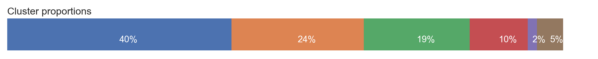

# Identifying faults in Opportunity Zone designation

  

Paxton Hyde, March 2020

## Content
- [Background](#background)
- [Objectives](#objectives)
- [Data](#data)
- [Clustering](#clustering)
- [Denver map](#mappingtheclusters)
- [Conclusions](#conclusions)
- [References](#references)

## Background

The 2017 U.S. Tax Cuts and Jobs Act introduced an Opportunity Zone (OZ) program to encourage investment in struggling communities. The program allows capital gains tax write-downs for investments in business or real estate in designated Census tracts. (A Census tract is a geographic subdivision of the country used for statistical purposes averaging about 4000 residents.) These tax benefits are intended to offset additional costs and risks associated with developing in neglected or weak markets. 

Investigative reporting on OZs focuses on instances where these tax breaks are flowing to luxury developments in gentrifying neighborhoods.[1](#footnote1) For example, the *Economist* notes that the Old Port neighborhood in downtown Portland, ME was designated as an OZ despite its success as a tourist destination.[2](#footnote2) The proliferation of stories like this one suggests that the program funding is being spent in neighborhoods that should not have qualified as OZs in the first place.

On top of that, there is no solid evidence for the effectiveness of place-based tax incentives. Research shows that they do little to improve the economic well-being of original residents, because any new jobs created either replace jobs that already existed or are taken by high-skilled workers who move in and gentrify the area.[3](#footnote3)

President Trump has proclaimed the OZ program a success, despite the fact that the Treasury Department has an open investigation into corruption in the designation process.[4](#footnote4)[,5](#footnote5) There is no way for the government to prove or disprove his claim, because the law does not require any data collection or reporting on the program.[6](#footnote6)

#### Opportunity Zone Designation Process

      

There is little opportunity for public or legislative input in the designation process. State Governors nominate Census Tracts in their state as OZs, and the Secretary of the Treasury approves these selections. A tract is eligible if:
 
* it meets the requirements of a *low-income community* (LIC), meaning that it has a 20% poverty rate and a median family income is no more than 80% of the revelant surrounding area;[7](#footnote7), or  
 
* it is adjacent to an LIC and has a median household income of no more than 125% of that tract. 

Governors may nominate up to one-quarter of the LIC tracts in their state, or up to 25 if their state has less than 100 LICs. In addition, they may nominate a number of LIC-adjacent tracts up to five percent of the total tracts in the state. Designations are based on data from 2011-2015 or more recent American Community Survey (ACS) 5-year estimates.[8](#footnote8) The original designations were already based on outdated information because the ACS is released annually.

Giving a governor the power to nominate OZs has both benefits and pitfalls. She may use her local knowledge to make an informed judgment about which areas will most benefit from the tax incentives, or she could use her power to direct money to investments held by her connections or donors. The Secretary of the Treasury has no interest in exercising reasoned oversight of the program because he is not an elected official. It is worth asking: why exclude legislative bodies from the designation process when they are the people who best understand the needs of their communities?

## Objectives

My method for finding flaws in the designation process using data science is as follows:

1. Collect data through the Census API

2. Compare designated OZs with tracts that were eligible but not picked

3. Identify zones whose OZ status is questionable using a clustering algorithm, and

4. Make suggestions for a revised designation process

## Data

I gathered tract-level data from the 2012 and 2017 ACS 5-year estimates using the Census Data API and the open-source [`census`](https://pypi.org/project/census/) module from PyPi.

This amounted to ~73,000 tracts for the entire country, of which ~40,000 (57%) were eligible for OZ benefits and 7,710 (13%) were designated as OZs. The fact that a majority of the country was eligible for tax breaks shows that the quantitative criteria were not very stringent and that there was a lot of room for governors to play with their choices.

#### Feature Selection and Engineering

I engineered features to show the economic and demographic characteristics of each tract. 

Economic development is represented by:
- increase in housing units, and more recent average year of construction
- increasing population
- increasing home value and income
- decreasing poverty, and
- low vacancy

Demographics are represented by:
- racial composition
- homeownership
- educational attainment and current students, and
- proportion of single unit homes and mobile homes gives some insight into whether the area is urban, suburban, and rural

Note: I represented household income and home value as a percent change between 2012 and 2017 rather than an absolute value as to avoid a comparison based on an area's cost of living. I did the same for population and number of housing units to represent changing demand in an area. I standardized the features on a 0-1 scale to make comparison across multiple variables effective.

  

The feature correlation matrix shows that homeownership is strongly correlated with % single unit housing, so I excluded that feature.

For the sake of keeping relevant demographic information, I did not want to exclude % white or black (other races serve as the excluded category), or bachelor's degree, or % poverty even though they were somewhat correlated.

#### Exploratory Data Analysis

The only *z-*significant differences between all OZ-eligible tracts and designated OZs were demographic.

  

OZs have significantly less single unit housing and homeowners, suggesting that governors chose more urban tracts over rural tracts. It makes sense that governors would concentrate their development efforts in cities rather than rural areas with smaller markets. OZs also tend to have a greater minority population, which could be because *(a)* urban areas tend to be less white, *(b)* non-white Americans are more likely to be impoverished, or possibly *(c)* governors perceive non-white communities as less economically developed whether they are or not. Although statistics like a lower home ownership and a higher non-white population are correlated with higher poverty (see "feature collinearity" above), there was no significant difference between poverty in OZ-eligible tracts and designated OZs. This shows that OZ benefits were not concentrated in the areas of greatest need.

The principal component plot below shows no clear separation between the groups. (Each principal component represents a linear combination of all the features. This plot does not show all the multidimensional variance, it is a simple visualization tool.)

  

I identified the "suspicious" tracts marked in the figure from investigative reporting in the Economist, The New York Times, and ProPublica.org. These include:

* Old Port in Portland, ME, which is a gentrifying tourist area

* the Warehouse District in NOLA, which is another gentrifying area

* Market Square Park in Houston, which is the site of [several](https://www.hines.com/properties/the-preston-houston) [luxury](https://www.arismarketsquare.com/?utm_source=GoogleLocalListing&utm_medium=organic) [developments](https://www.marketsquaretower.com/?utm_source=GoogleLocalListing&utm_medium=organic)

* Water Street and Sparkman Wharf in Tampa Bay, the site of [a new luxury development](https://waterstreettampa.com/) owned by the owner of the Tampa Bay Lightning

* Northwood Gardens in West Palm Beach, home to Rybovich superyacht marina, and

* College Park, MD, which has part of the University of Maryland campus

## Clustering

I used a clustering algorithm to group all designated OZ tracts into similar groups, with the goal of identifying some outlier groups and getting a better picture of OZs as a whole.

Using a KMeans algorithm produced the most interpretable clusters. The algorithm minimizes the total distance between all data points in the cluster and the cluster's centroid.

  
  

Cluster 0 - Suburban

Cluster 1 - Urban early gentrification

Cluster 2 - More rural with population loss

Cluster 3 - Higher poverty and black population

Cluster 4 - Student or university area

Cluster 5 - Recent development

-----

Clusters 4 and 5 are small and odd enough that their designations should be reviewed. Although students are poor, they are not the target of the OZ program. Cluster 5 has developed rapidly and may have been misdesignated based on outdated 2011–15 ACS estimates.

Clusters 2 and 3 appear to be appropriate targets for the program, although gentrification could threaten their residents.

Clusters 0 and 1 are the majority groups and less interpretable. All the “suspicious” tracts I found were part of these groups, which means that this algorithm did not identify the same outliers that were found by investigative journalists.

#### Error metric

This visualization of the clusters on a principal component plot shows the overlap of the clusters. Remember there are other dimensions that are not represented in this plot.

  

The silhouette coefficient is a common measure of clustering error. It is the ratio of the intra- to inter-cluster distances on the range [-1, 1], where a negative number means that the point was closer to another cluster's centroid. The silhouette plot shows this coefficient for each observation.

  

Even though the error was significant, the interpretability of the clusters was more important to me in this study. It is also possible that the data was shaped oddly so that it did not cluster well in general, because error did not decrease with > 6 clusters.

## Mapping the clusters

I overlaid OZs color-coded by cluster on a map of Denver. It is important to remember that these specific tracts will not have the same metrics as the cluster averages shown on the cluster plot above. 

  

## Conclusions

My investigation has outlined that there is little opportunity for oversight in the OZ designation process and as a result the process was haphazdly executed. There were no significant differences between measures of economic development between eligible but unpicked tracts and designated OZs, meaning that the incentives were not well targeted to communities with the greatest need. Furthermore, I identified two groups of OZs – areas with very recent development and large student populations – that do not seem like appropriate targets for this spending. Finally, I offer these suggestions for how to improve the designation process:

> **Create stricter criteria for designation**

The criteria for Opportunity Zone designation should be made more stringent. I found two groups that do not seem to be appropriate targets for the OZ program: student neighborhoods and neighborhoods which had a rapid development between 2012 and 2017. 

The criteria should take into account other economic factors beyond just poverty and relative household income and use the most recent data available. This will reduce sacrificing government investment in areas that are already properous.

> **Require legislative approval**

The program should require that a governor's selections be approved by the state legislature. The public must have confidence that governors cannot use the program to grant favors. Furthermore, effectively targeting these benefits requires intimate knowledge of the hyperlocal economy and landscape. Although state governors may be capable, local legislators know the economic needs of their communities better than anyone else.

> **Collect data on the program**

Federal lawmakers have introduced two bills to require data collection and reporting on OZs (H.R. 5042 and S. 1344).[6](#footnote6) Without revising the designation criteria, the OZ program will appear to be a success because already prosperous areas were included. 

Any data collection effort should also track who is moving in and out and demographic changes that show gentrification or the displacement of the original residents. There is little scientific evidence that previous place-based tax incentives benefitted the communities they were intended to help, so the public should not accept any claims of success without rigorous proof.

[Back to top](#content)

## References
<a name="footnote1">1</a> Critical reporting on Opportunity Zones:

- [How a Trump Tax Break to Help Poor Communities Became a Windfall for the Rich](https://www.nytimes.com/2019/08/31/business/tax-opportunity-zones.html): *The New York Times*  (08/31/2019)

- [A Trump Tax Break To Help The Poor Went To a Rich GOP Donor’s Superyacht Marina](https://www.propublica.org/article/superyacht-marina-west-palm-beach-opportunity-zone-trump-tax-break-to-help-the-poor-went-to-a-rich-gop-donor): *Pro Publica* (11/14/2019)

- [The Biggest Tax Cut You've Never Heard Of](https://www.economist.com/leaders/2018/11/17/the-biggest-tax-cut-youve-never-heard-of): *The Economist* (11/17/2018)

<a name="footnote2">2</a> [Bringing Investment to Poor Places](https://www.economist.com/united-states/2018/11/17/bringing-investment-to-poor-places): *The Economist* (11/17/2018)

<a name="footnote3">3</a> [Opportunity Zones:  What We Know and What We Don’t](https://files.taxfoundation.org/20190107155914/Opportunity-Zones-What-We-Know-and-What-We-Don%E2%80%99t-FF-630.pdf): Eastman, Scott and Nicole Kaeding, *The Tax Foundation* (01/07/2019)

<a name="footnote4">4</a> [Donald Trump 2020 State of the Union Address, mention of Opportunity Zones](https://www.youtube.com/watch?v=zNECVmfJtxc&t=15m38s): *Youtube* (02/06/2020)

<a name="footnote5">5</a> [Trump Tax Break That Benefited the Rich Is Being Investigated](https://www.nytimes.com/2020/01/15/business/trump-opportunity-zone-investigation.html?action=click&module=Latest&pgtype=Homepage): *The New York Times*  (01/15/2020)

<a name="footnote6">6</a> Bills in-progress to regulate Opportunity Zones:

- [S.1344 - A bill to require the Secretary of the Treasury to collect data and issue a report on the opportunity zone tax incentives](https://www.govtrack.us/congress/bills/116/s1344), *govtrack.us*

- [H.R.5042 - Opportunity Zone Reform Act](https://www.govtrack.us/congress/bills/116/hr5042), *govtrack.us*

<a name="footnote7">7</a> [Definition of "Low-Income Community" – (26 USC § 45D(e)(1))](https://www.law.cornell.edu/uscode/text/26/45D): *law.cornell.edu*

<a name="footnote8">8</a> [Internal Revenue Code (26 USC §§ 1400Z)](https://www.law.cornell.edu/uscode/text/26/subtitle-A/chapter-1/subchapter-Z): *law.cornell.edu*, and

- [QOZ designation procedures (6 CFR 601.601: Rules and regulations)](https://www.irs.gov/pub/irs-drop/rp-18-16.pdf): *Internal Revenue Code*

[Opportunity Zones Resources](https://www.cdfifund.gov/Pages/Opportunity-Zones.aspx): *CDFI Fund*
